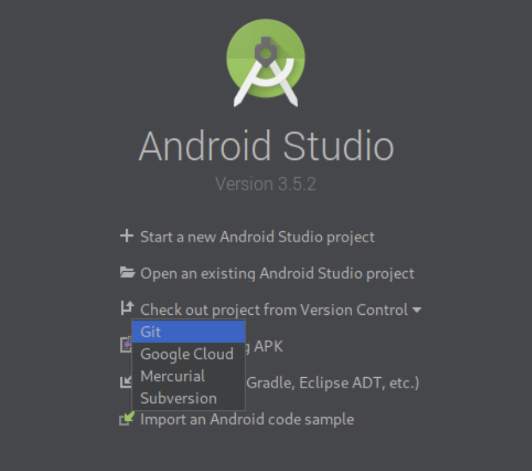

# Antons Skafferi App
Projektarbete för kursen DT142G - Java Applikationsutveckling HT19. Projektet är ett arbete med 10 deltagare där arbetet är uppdelat parvis för utvecklandet av en komplett miljö för en restaurang innehållande app och webbsida med tillhörande backend server. Nedan följer en beskrivning av applikationen..

Utvecklingsmiljö: Android Studio

## Klona i Android Studio
Här beskrivs hur projektet klonas i Android Studio för att kunna testköra applikationen på egen dator. 

1. Öppna Android Studio och välj *Check out project from Version Control*.
   

2. Skriv in projektets URL (https://github.com/atemmel/antons-skafferi-app.git) och välj vart projektet ska sparas lokalt. 
   

3. Du kan nu behöva logga in med ditt GitHub användarnamn + lösenord. 

4. Vänta på att projektet synkas färdigt. Om allting inte är grönt prova ta bort allt och börja om. 
   

## Titta på olika branches
Om du nu vill titta på något som är under utveckling behöver du välja branchen för denna funktion. 

#### Du kan antingen göra detta manuellt:
```
git branch <branchname>
```

#### Eller så kan du använda Android Studios inbyggda branch-hantering:

1. Visa samtliga branches med hjälp av denna knapp i nedre höra hörnet:
   

2. Välj den branch du vill se och välj *Checkout As...*
   

3. Om det är första gången du tittar på denna branch kommer Android Studio fråga om du vill skapa den lokalt, välj *OK*. 
    

## Funktionalitet
Appen är tänkt att fungera för personal och för restaurangverksamheten. Personalen ska ha en egen inloggning vars största syfte är att hålla en översikt över aktuellt schema och för att hålla kommunikation med restaurangen på ett smidigt sätt. Detta för att bland annat enkelt meddela sjukdom eller annan frånvaro. 

Restaurangverksamheten har även dessa nytta av appen i form av att de kan se vilka bord som är bokade, beställningar kan tas av servitörer och matlagningspersonalen kan i realtid se nya beställningar.

### Personal
* Inloggning
* Se pass
* Se andras pass
* Boka/avboka pass
* Kommunikation med restaurang
* Kontaktuppgifter till andra anställda
* Egen profil

### Restaurang
* Lagerstatus
* Bokade bord
* Se beställningar
* Ta beställning


## Git workflow
Masterbranchen innehåller alla de senaste funktionerna. Varje commit/merge till master måste innehålla en komplett funktion och/eller bugfix. Varje commit/merge till master är en ny release-version av applikationen. 

Development är den aktiva utvecklingsbranchen. När en ny funktion ska implementeras branchar man från development, där efter branchar man igen lokalt. Detta för att om flera jobbar på samma funktion samtidigt så uppstår färre konflikter. När man är klar med sin lokala branch så gör man en pull request för den senaste commiten från den funktion man jobbar på, och rebasear på den. Sen mergas funktionsbranchen in i development.

Se till att informera alla om vilken branch man jobbar i så att det inte blir onödiga merge conflicts. När man är färdig att jobba med en funktion mergeas feature branchen till development och kan därefter tas bort. Inför en ny sprint mergeas allt till master branchen och nya feature branches skapas efter behov.

## Git howTo guide
Några bra-att-ha kommandon för git

#### Check branch
```
git branch
```

#### Change branch
```
git checkout <branchName>
```

#### Remove branch locally
```
git branch -d <branchName>
```

#### Reset changes to last pull request
```
git reset --hard
```

#### Remove commit without losing changes
```
git reset HEAD~1 --soft
```
## Error codes
```
405: Felformaterad JSON
```

# Developers

- Oscar Fredriksson [Github Page Overview](https://github.com/oscarFredriksson)
- Amanda Ericson [Github Page Overview](https://github.com/amandaericson)
- Jonas Carlsson [Github Page Overview](https://github.com/manjaro97)
